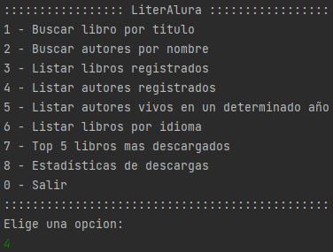
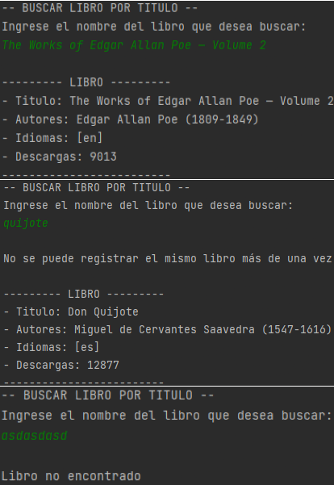
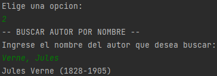
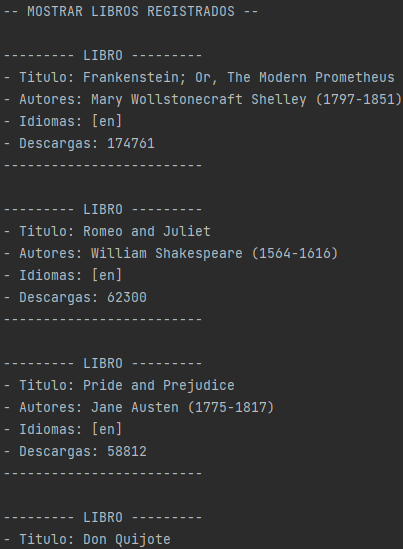
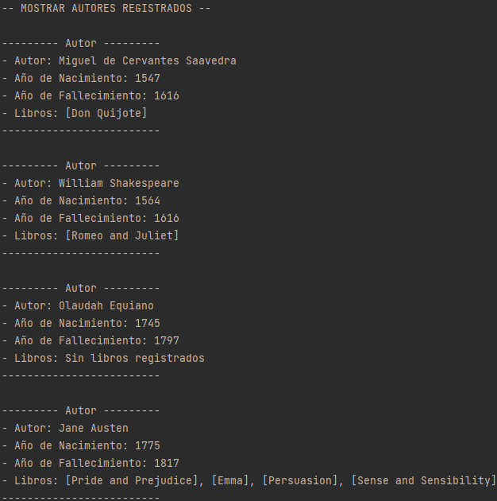
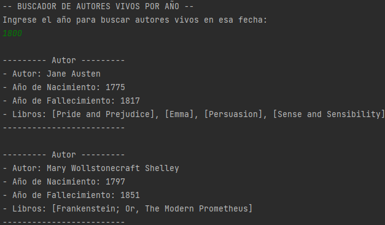
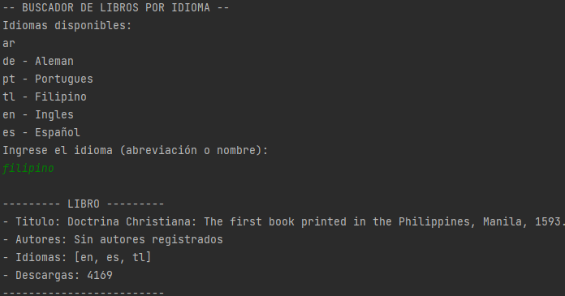
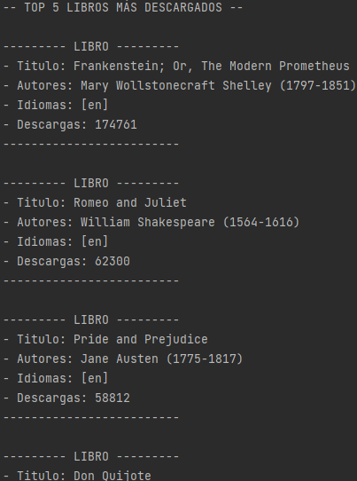
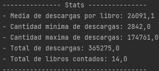

# Challenge LiterAlura - ONE (Oracle Next Education)
---
#### Autores: José Ajuriagogeascoa
#### Para ONE + Alura Latam.
***

## 📝 Descripción
LiterAlura es una aplicación de consola desarrollada en Java con Spring Boot, diseñada para gestionar y consultar una base de datos en PostgreSQL con libros y autores. La aplicación se integra con la API de Gutendex para registrar libros y autores en la base de datos. Utiliza Spring Data JPA para la persistencia eficiente de datos y demuestra cómo combinar integración con APIs externas y manejo de datos relacionales de manera efectiva.

## 🏆 Desafío
Desarrollar un programa de conversor de monedas en Java con las siguientes características:
* **Búsqueda avanzada de libros**: Realizar consultas desde la consola mediante **palabras clave**, **autores**, **géneros**, **temas** y genera **estadísticas** basadas en los resultados obtenidos.
* **Integración con Gutendex**: Acceder a un **amplio catálogo de libros** actualizados a través de una API pública.
* **Almacenamiento local**: Guardar y administrar **información relevante** en una base de datos **PostgreSQL** para 
  consultas recurrentes.
* **Interfaz de consola intuitiva**: Comandos fáciles de usar, ideales para usuarios y desarrolladores.

## Tecnologías Utilizadas
* **Backend:**
  * **Java**: Lenguaje principal para el desarrollo de la aplicación.
  * **Spring Boot**: Framework utilizado para estructurar el backend y gestionar la lógica de negocio.
  * **PostgreSQL**: Base de datos relacional utilizada para almacenar información sobre los libros y búsquedas realizadas.
* **API externa**: Solo la funcionalidad de búsqueda inicial consulta datos de una API externa; las demás operaciones trabajan directamente con la base de datos.

## Ejecución del Programa
#### Menú

#### Registar|Buscar Libros por Nombre

#### Registar|Buscar Autores por Nombre

#### Mostrar Libros Registrados

#### Mostrar Autores Registrados

#### Buscador de Autores vivos por año

#### Buscador de Libros por Idioma

#### Top 5 Libros más descargados

#### Estadísticas de descargas

## 📞 Contacto
* GitHub: [Joseajuria00](https://github.com/Joseajuria00)
* LinkedIn: [José Ajuriagogeascoa D'Amico](https://www.linkedin.com/in/joseajuriagogeascoa/)
